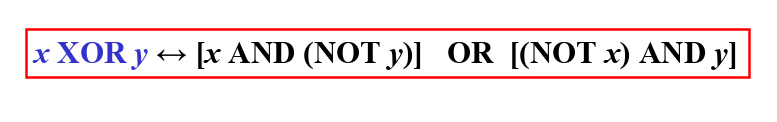
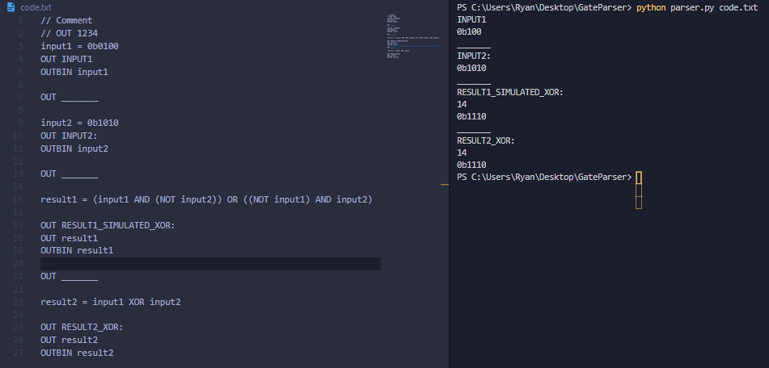
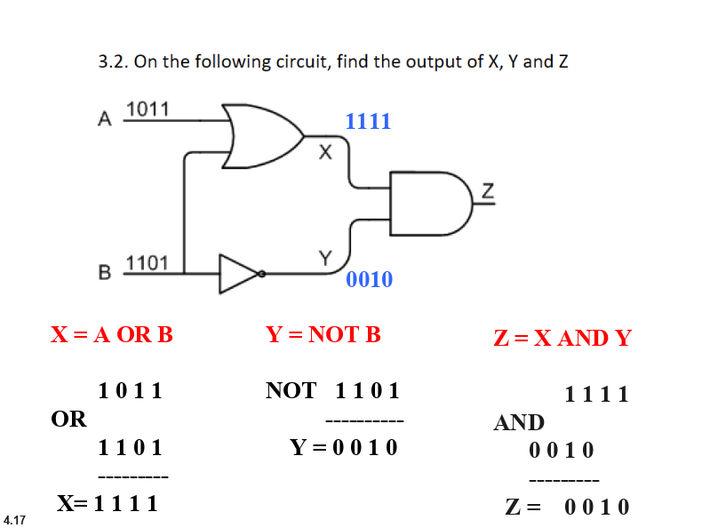
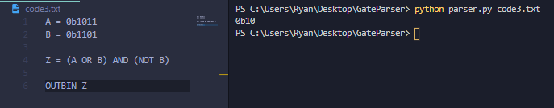

# Gate Expression Parser
## README is a WIP, studying for midterm exams

Inspired by this expression in the CPIT201 book, I decided to write code to parse the expression and obtain the result. Somehow, the code I wrote to parse the expression ended up becoming a very simple language.

### Note
There is a small bug with how `NOT` works, instead of flipping the given bits, it flips all bits (Bits are stored as a number, not a string). To avoid the bug, use `1111 XOR 1100` instead of `NOT 1100`

# Example 1





# Example 2





# Process to parse each line
For example, with this line of code
```haskell
result1 = (input1 AND (NOT input2)) OR ((NOT input1) AND input2)
```
It will go through this process:

- Convert each part into a '`Token`'
```
['result1', '=', '(', 'input1', 'AND', '(', 'NOT', 'input2', ')', ')', 'OR', '(', '(', 'NOT', 'input1', ')', 'AND', 'input2', ')']
```
- Convert the expression into Reverse Polish Notation (also known as Postfix)
```
['result1', 'input1', 'input2', 'NOT', 'AND', 'input1', 'NOT', 'input2', 'AND', 'OR', '=']
```
- Then, the Postfix expression will be parsed as such:
	- Operands are pushed onto the Stack
	- Operators pop the needed operators from the stack
	- The result is pushed back onto the stack
	- Repeat until the expression is finished

# References
- [Reverse Polish Notation Video](https://www.youtube.com/watch?v=7ha78yWRDlE)
- [Reverse Polish Notation Algorithm Implementation](https://www.geeksforgeeks.org/stack-set-2-infix-to-postfix/)
